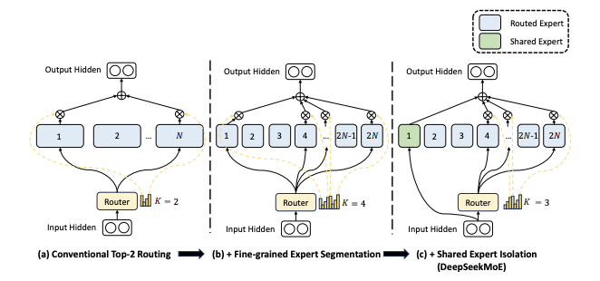
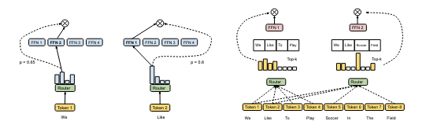

## Mixture of Experts - MLX

### Models
#### DeepSeek-MoE
</img>

The two important contributions of DeepSeek-MoE are
 - Finely segmenting the exeprts
  - The idea is that if you have $N$ experts instead we will finely segment this experts more to have $mN$ experts, and the same for the routed experts where now we will have $mK$ routed experts
  - This idea helps with the problem of **Knowledge hybridity** (where an expert will have to mix a lot of differnt knowledge into its parameters instead of bieng more specialized), and consequently encourages sharper specialization
- Shared expert isolation
  - We isolate $K_s$ experts as shared ones (this experts are always active)
  - The idea here is that this models will capture general knowledge so as to reduce knowledge redundancy between the other experts (e.g. there is one expert that learns biology and another Laws, but in the end both have to learn about language, so instead we can have a shared expert that learns about language instead).
  - In the end the implementation looks like this:
  	- $h_t^l = \sum_{i=1}^{K_s} \mathrm{FFN}_i\!\left(u_t^l\right) + \sum_{i=K_s+1}^{mN} g_{i,t}\,\mathrm{FFN}_i\!\left(u_t^l\right) + u_t^l$
    - $$ g_{i,t} =
      \begin{cases}
      s_{i,t}, & s_{i,t} \in \mathrm{Topk}\!\left(\{\, s_{j,t} \mid K_s + 1 \le j \le mN \,\},\, mK - K_s\right) \\
      0, & \text{otherwise}
      \end{cases}
      $$
    - $s_{i,t} = \mathrm{Softmax}_i\!\left( (u_t^l)^\top e_i^l \right)$
    - Where:
      - $e^l_i$ ($i$ is the expert and $l$ is the layer) is the learned weight embeddings of the experts where $e \in R^{\text{hidden dim } \cdot \text{ number of experts}}$
      - $u$ is the result of the final projection of the Attention layer, where $u \in R^{\text{batch size} \cdot \text{seq len} \cdot \text{hidden dim}}$
      - $s$ are basically what we call the affinities that each token has to an expert, based on this we choose the experts that have the biggest affinity to a specific token and always our shared expert
      - $s$ are the end result affinities where the experts that where not chosen get a $g = 0$, so in the end they don't contribute anything to $h$, adn this is why MoE are sparse


### Auxiliary losses
Automated learned routing strategies may encounter load imbalance, where
  - The model always select only a few experts (*routing collapse*)
  - And if the experts are distributed across multiple devices, then we can create computation bottlenecks basically

For this we use:
- **Expert level balance loss (from *DeepSeek-MoE*)**
  - Here the shared experts don't contribute to the loss as they are always chosen
  - $L_\text{ExpBal} = \alpha_1 \sum^{\hat{N}}_{i=1}f_i P_i$
  - $f_i = \frac{\hat{N}}{\hat{K}T} \sum^T_{t=1} \mathrm{1}(\text{Token t selects expert i})$
  - $P_i = \frac{1}{T} \sum^T_{t=1} s_{i,t}$ 
  - Where: 
    - $\alpha_1$ is a hyperparameter called "expert-level balance factor", $\hat{N}$ is equal to ($mN - K_s$) and $\hat{K} = (mK-K_s)$ (so basically the experts that are not shared experts), $\mathrm{1}(\cdot)$ is the indicator function (where 1 if true and 0 if not) and T is the total number of tokens so $\text{batch size} \cdot \text{sequence length}$ (we basically balance across the whole batch)
  - This loss forces the way the experts are chosen to be uniform. Because, if it decides to always choose the same experts for every token ($s_{i,t}$ always small for everyone else), it's value will get bigger (because from the load balance loss we can see how our average $s_i$ (that is $P_i$) over all the tokens will get multiplied by $f_i = \hat{N}/\hat{K}$ (because the sum of selected tokens will be equal to $T$)), so it is better to balance the values because like this $f_i$ and $P_i$ values will be smaller.
  - And here there is no problem for auto-regression as this auxiliary loss is only used during the training (so using total tokens in the whole batch for this there is no problem).
    - The thing is as in the *OpenMoE* paper showed, this routing function is learned during the pre-training but at fine-tuning the distribution of tokens can be Out-of-distribution (That it is a very different type of corpus to learn in how it is structured), and here the routing rule in the end can collapse a little where now some experts will receive a bigger amount of tokens than others (now we don't have a good load balance)

- **Load balancing loss (from *Switch transformer*)**
  - loss = $\alpha \cdot N \cdot \sum_{i=1}^{N} f_i \cdot P_i$ (4)
    - where $f_i$ is the fraction of tokens dispatched to expert $i$, $$f_i = \frac{1}{T} \sum_{x \in B} \mathbb{1} \{\mathop{\mathrm{argmax}} p(x) = i \}$$ (5)
    - and $P_i$ is the average of the router probability allocated for expert $i$ over all the tokens, $$P_i = \frac{1}{T} \sum_{x \in B} p_i(x)$$
    - Here again if the router keeps favoring the same experts, they will get $f_i \approx 1$ and the sum of $P_i$ will approximate 1 only for the chosen experts and the others it will go to 0. And in the end the loss will be $\alpha \cdot N$ 
      - And if instead it is uniformly across all experts we will have $f_i = 1/N$ and $P_i = 1/N$ so in the end we have $\alpha \cdot N \cdot N \cdot 1/N^2 = \alpha$ 
- **Noisy Top-K load estimator and load-balance loss (from *Outrageously Large Neural Networks: The Sparsely-Gated Mixture-of-Experts Layer*)** ((This implementation is still difficult for me to understand))
  - $$
  P(x, i)
  = \Pr\Bigl((x \cdot W_g)_i + \mathcal{N}(0,1)\,\times\,\mathrm{Softplus}\bigl((x \cdot W_{\mathrm{noise}})_i\bigr) > \mathrm{kth\_excluding}\bigl(H(x),\,k,\,i\bigr)\Bigr)$$
  - where `kth_excluding(v, k, i)` returns the $k$-th largest entry of $v$ *excluding* the $i$-th. (So basically here they are doing a z-score to then grab from the the table of the Normal gaussian CDF?)
  - $$ P(x, i = \Phi\!\Bigl(
    \frac{(x \cdot W_g)_i - \mathrm{kth\_excluding}(H(x),k,i)}
         {\mathrm{Softplus}\bigl((x \cdot W_{\mathrm{noise}})_i\bigr)}
  \Bigr)$$ with $\Phi$ being the CDF of the standard normal.

  - $$\mathrm{Load}(X)_i = \sum_{x \in X} P(x, i)$$
  - $$\mathcal{L}_{\mathrm{load}}(X) = w_{\mathrm{load}}\bigl(\mathrm{CV}\bigl(\mathrm{Load}(X)\bigr)\bigr)^2$$

    - Here **CV** is the *coefficient of variation* of the load vector $v$ (This part of **CV** I don't understand it)
  - But basically models use instead the other load balance losses and remove the Noise from the routing as it seems it was a very difficult to tune the **CV** and in the end it seems more simple regularizers or hard capacity factors give better results 

### Router types
- **The common top-k experts for each token (from *Outrageously Large Neural Networks: The Sparsely-Gated Mixture-of-Experts Layer*)** (*This implementation is still difficult for me to understand*)
  - $$G(x) =\mathrm{Softmax}\,\bigl(\mathrm{KeepTopK}\bigl(H(x),\,k\bigr)\bigr)$$
  - $$H(x)_i =(x\,W_g)_i + \mathcal{N}(0,1) \times \mathrm{Softplus}\bigl((x\,W_{\text{noise}})_i\bigr)$$
  - $$\mathrm{KeepTopK}(v,k)_i =
    \begin{cases}
    v_i,&\text{if }v_i\text{ is among the top-}k\text{ entries of }v,\\
    -\infty,&\text{otherwise.}
    \end{cases}
  $$
  - Here the idea is that we want to select $K$ experts for each token. Also here we can see that the softmax will be done instead on only the $K$ chosen using the logits instead of the one in DeepSeek-MoE where we choose the $K$ from the softmax result instead (and here the probabilities are not normalized (because after the selection they will not sum to 1))
  - In this paper they also use the noise and softplus (that will control the amount of noise per component)
    - The idea of the Noise is to have load balance, because the amount of tokens an expert receives is something discrete we can't have backpropagation
      - So we have first that we wil model each variable as a Guassian random variable where $(x\,W_g)_i + \sigma \cdot \mathcal{N}(0,1)$ and we are asking what is the probability that my logits are bigger than the biggest logit from all the other experts
      - And from this we can basically do another type of Load balance
    - But in the end instead the the noise factor has stop being used because it seems it was more costly and difficult to tune the **CV** factor, 
      - **And instead we use the Switch balance loss or other regularizers, and with this it is not necessary to use the Noise to do the balancing loss**
        - $$G(x)  = \mathrm{Softmax}\,\bigl(\mathrm{KeepTopK}\bigl(H(x),\,k\bigr)\bigr)$$
        - $$H(x)_i  = (x\,W_g)_i$$
        - $$\mathrm{KeepTopK}(v,k)_i =
          \begin{cases}
          v_i,&\text{if }v_i\text{ is among the top-}k\text{ entries of }v,\\
          -\infty,&\text{otherwise.}
          \end{cases}
        $$
        - Or we do the TopK after the softmax instead

- **Expert Choice Routing (from *Mixture-of-Experts with Expert Choice Routing*)**
</img>
  - For this version now the idea is that the amount experts used for a token can be variable (instead of having a forced $K$ amount of experts), and here instead each expert can only use $K$ amount of tokens
  - So basically this version tries to fix the problems of:
    - Load imbalance: Because it is possible for some experts to be under-utilized during training and a sub-optimal strategy can produce redundant experts and/or experts that are not sufficiently specialized 
      - But at least I think *DeepSeek-MoE* fixes this somewhat using the idea of shared experts and just having more experts to use in general
  - And supposedly this method allows for perfect load balancing despite its simplicity, using variable number of experts for each token, and achieves substantial gains in training efficiency and downstream task performance
  - Formula:
    - Let $X \in \mathbb{R}^{n \times d}$ be the token representations. The routing produces
		$I, G, P$ where:
		- $I \in \{1,\dots,n\}^{e \times k}$ is an index matrix; $I[i,j]$ is the index of the $j$-th selected token for expert $i$.
		- $G \in \mathbb{R}^{e \times k}$ are the gating weights for the selected tokens.
		- $P \in \{0,1\}^{e \times k \times n}$ is the one-hot version of $I$ used to gather/scatter tokens.
		
		The gating function is:
		$$
		S = \mathrm{Softmax}(X W_g), \qquad S \in \mathbb{R}^{n \times e}, W_g \in \mathbb{R}^{d \times e}
		$$
		
		$$
		G,\, I = \mathrm{TopK}(S^\top,\, k), \qquad P = \mathrm{OneHot}(I)
		$$
		
		Inputs to each expert’s FFN are gathered by $P$:
		$$
		X_{\mathrm{in}} = P \cdot X, \qquad X_{\mathrm{in}} \in \mathbb{R}^{e \times k \times d}
		$$
		
		Per-expert FFN (biases omitted), with $W_1[i], W_2[i] \in \mathbb{R}^{d \times d'}$:
		$$
		\forall i:\quad X_e[i] = \mathrm{GeLU}\!\big(X_{\mathrm{in}}[i]\, W_1[i]\big)\, W_2[i]^\top
		$$
		
		Final MoE layer output (combining permutation $P$ and gates $G$):
    $$
    X_{\mathrm{out}}[l, d] = \sum_{i=1}^{e} \sum_{j=1}^{k} P[i, j, l] \, G[i, j] \, X_e[i, j, d],
    \qquad X_{\mathrm{out}} \in \mathbb{R}^{n \times d}.
    $$
  - They set the number of tokens each expert can have as $top\_k = \frac{n \cdot c}{e}$
  	- Where $n$ is the total number of tokens in the input batch (batch_size x sequence length), $c$ is the capacity factor (it denotes on average how many experts are utilized by a token), and $e$ is the number of experts
  	- **But because of this capacity factor, it is possible for some tokens to be dropped, and that's why it seems with this version it helps to have the MoE instead on all layers to only have it for example in every other layer** (or at least thats their theory)
    	- And even this problem can happen in the other routing versions because sometimes capacity factors are also used and in the implementation of **OpenMoE** they showed that in pretraining it work correctly but then going to finetuning (because it is a little bit out-of-distribution) the amount of tokens drop would get high. And their idea to fix this was to use part of the finetuning data in the pretraining (Not for alignment but to help with load balancing)
	- **Limitations**
  	- Lastly this implementation has the problem that it might not work in auto-regressive generation, because the method takes into account past and future tokens to do the top-k selection
    	- During teacher forcing it does have access to the past and future information, so it is possible to train the Decoder LLM with this, but then when generating at each step the amount of tokens is different at each step (**and the capacity factor is based on the total amount of tokens when doing the teacher forcing**), so the behaviour of the model could break the load balance and even the performance of the model maybe
  - **Questions**:
    - For this routing method I don't understand why is it that they apply the softmax over the expert dimension and no the token dimension


## What type of MoE implementations do new LLM's use:
- DeepSeek
  - Seems to use the normal Expert Load balance loss for the auxiliary loss
  - They use 1 shared expert in DeepSeek-MoE
  - The routing function they use is the normal top-k experts
  - I think they don't use a capacity factor
- Qwen 2.5 and 3
  - For the routing function it seems they use the normal top-k experts with Switch load balance loss
- Qwen 3 Next
  - They use the shared expert idea and it seems they increase the amount of finely grained experts and the amount of top-k experts that are used
  - For the routing function I think they use the same one of 2.5

## Implemenations
- The noisy top-k from Shazeer is not implemented.

## Citation

```bibtex
@misc{shazeer2017outrageously,
    title   = {Outrageously Large Neural Networks: The Sparsely-Gated Mixture-of-Experts Layer},
    author  = {Noam Shazeer and Azalia Mirhoseini and Krzysztof Maziarz and Andy Davis and Quoc Le and Geoffrey Hinton and Jeff Dean},
    year    = {2017},
    eprint  = {1701.06538},
    archivePrefix = {arXiv},
    primaryClass = {cs.LG}
}
```

```bibtex
@misc{dai2024deepseekmoeultimateexpertspecialization,
      title={DeepSeekMoE: Towards Ultimate Expert Specialization in Mixture-of-Experts Language Models},
      author={Damai Dai and Chengqi Deng and Chenggang Zhao and R. X. Xu and Huazuo Gao and Deli Chen and Jiashi Li and Wangding Zeng and Xingkai Yu and Y. Wu and Zhenda Xie and Y. K. Li and Panpan Huang and Fuli Luo and Chong Ruan and Zhifang Sui and Wenfeng Liang},
      year={2024},
      eprint={2401.06066},
      archivePrefix={arXiv},
      primaryClass={cs.CL},
      url={https://arxiv.org/abs/2401.06066},
}
```

```bibtex
@misc{fedus2022switchtransformersscalingtrillion,
      title={Switch Transformers: Scaling to Trillion Parameter Models with Simple and Efficient Sparsity},
      author={William Fedus and Barret Zoph and Noam Shazeer},
      year={2022},
      eprint={2101.03961},
      archivePrefix={arXiv},
      primaryClass={cs.LG},
      url={https://arxiv.org/abs/2101.03961},
}
```

```bibtex
@misc{zhou2022mixtureofexpertsexpertchoicerouting,
      title={Mixture-of-Experts with Expert Choice Routing},
      author={Yanqi Zhou and Tao Lei and Hanxiao Liu and Nan Du and Yanping Huang and Vincent Zhao and Andrew Dai and Zhifeng Chen and Quoc Le and James Laudon},
      year={2022},
      eprint={2202.09368},
      archivePrefix={arXiv},
      primaryClass={cs.LG},
      url={https://arxiv.org/abs/2202.09368},
}
```

```bibtex
@misc{xue2024openmoeearlyeffortopen,
      title={OpenMoE: An Early Effort on Open Mixture-of-Experts Language Models}, 
      author={Fuzhao Xue and Zian Zheng and Yao Fu and Jinjie Ni and Zangwei Zheng and Wangchunshu Zhou and Yang You},
      year={2024},
      eprint={2402.01739},
      archivePrefix={arXiv},
      primaryClass={cs.CL},
      url={https://arxiv.org/abs/2402.01739}, 
}
```