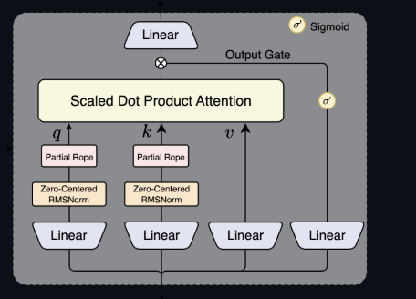

## Gated Attention for LLM's - Non-Linearity, Sparsity, and Attention-Sink-Free [paper](https://arxiv.org/abs/2505.06708)
**I think this is the gated Attention that they use in the Qwen3 Next Model**, they just now apply RMSNorm to $q$ and $k$ instead of after Attention result and do the Partial Rope

</img>

In this paper they investigate with different gating mechanisms in the standard softmax attention. And they found that Gating attention does two things
  - Applying a head-specific sigmoid gate after the scaled Dot-Product attention consistently improves performance and also enhances training stability, tolerates larger learning rates, and improves scaling properties.
	- And they attribute this effectiveness to two key factors:
		- Introducing non-linearity upon the low-rank mapping in the softmax attention
			- Remember it is low rank because $W_v$ and $W_o$ are of size (d_model, d_k) and (d_k, d_model), where $d_k \ll d_{model}$, this means that the product $W_vW_o$ (two low rank linear maps in a row are still one low-rank linear mapping) is a low rank linear mapping (the rank of the matrices can't be bigger than $d_k$). So in the end the head can only express function that live in that low-dimensional space
		- Applying query-dependent sparse gating scores to modulate the dot-product attention and create sparsity from this
	- And the most notable thing they find is that this sparse gating mechanism mitigates 'attention sink' and enhances long-context extrapolation performance (so when increasing the context length from what the model was trained on using things like YaRN)
		- **Attention sink**: is like a learned "parking spot" for attention mass when it doesn't find anything useful to attend to
			- The idea is that generally the attention heads will sometimes give the majority to one or some tokens (typically something like the \<start\>token), because Softmax always has to sum up to 1 so something has to get the probability mass.
			- So basically this token has its *key* learn a bias that attracts a steady chunk of the attention and the corresponding *value* of this token acts like a stable, learned baseline added into the residual stream.
				- *But the problem* is that this sink token gets attention even when it shouldn’t, which reduces the effective context the head uses and can hurt behaviors like long‑context extrapolation.

### Gated Attention

First lets formalize the gating mechanism:
 $\hat{Y} = g(Y, X, W_\theta, \sigma) = Y \odot \sigma(XW_\theta)$
- Where:
	- $Y$ is the input to be modulated,
	- $X$ is another input used to compute the gating scores
	- And $W_\theta$ refers to the learnable parameters for the Gate

Here $\sigma(XW_\theta)$ acts as a dynamic filter, controlling the information flow from $Y$ by selecting or erasing its features

Now lets remember **Multi-head attention**:
In multi-head attention, the output of the i-th token, corresponding to the k-the head can be expressed as:
- $$ o_i^{(k)} = \left( \sum_{j=0}^{i} S_{ij}^{(k)} \, X_j \, W_V^{(k)} \right) W_O^{(k)} = \sum_{j=0}^{i} S_{ij}^{(k)} \, X_j \left( W_V^{(k)} W_O^{(k)} \right)$$
  - Where
  	- $W_O^k$ is basically a slice of $W_O$ corresponding to the k-th head $W_O^k \in R^{hd_v \times d_{model}}$
  	- $S^k_{i,j}$ are the attention scores and $X_j$ is the input to the attention for token $j$
  - This shows that $W^k_V W^k_O$ can be merged into one low-rank linear mapping applied overall $X_j$ as $d_k$ < $d_model$ and this reduces the expressiveness (as we can only work in a lower dimension)
  - So their theory with gating is that doing $\text{Non-Linearity-Map}(X_jW_V^k)$ or $\text{Non-Lineartiy-Map}(\sum^i_{j=0} s^k_{i,j} \cdot X_j W_V^k)W^k_O$ helps improve the expressiveness mitigating the low-rank problem.
  - And this finding helps explain why in their experiments adding the gating after $W_o$ has no effect, and it is because it doesn't help address this lack of non-linearity in $W_V$ and $W_o$

#### And what did they found in the end:
In the end they found that doing head specific gating works the best and the two best methods they found that give the best results (reducing PPL by 0.2 and increasing MMLU score by 5 points) are:
- Value gating
  - In value gating we do
    - $\text{gate} = \sigma(XW_\theta)$
      - Where $W_\theta \in R^{d_{model} \times \text{number of heads}}$ and $X$ is our input to the Attention layer
      - And $\sigma$ is the sigmoid unction
    - Then we do the gating $\text{Value gating} = V \odot \text{gate}$
    - And finally we have $\text{Attention score} = (\text{Attention} @ \text{Value gating})$ and then we do $\text{Attention score} @ W_o$
  - When doing value gating the scores are derived from the past hidden states associated to the keys and values, because we first do the value gating and then we obtain the attention score multiplying by the value gates, we have to remember that Attention is a lower diagonal matrix (as we mask the future tokens) when doing matrix multiplication with V all the tokens get added.
- Scaled Dot Production Attention gating (this is the method that gives the best results)
	- Here we do
    	- $\text{gate} = \sigma(XW_\theta)$
      	-  Then we do the gating $\text{Attention score gating} = \text{Attention score} \odot \text{gate}$
      	-  Finally we do $\text{Attention score gating} @ W_o$
   	-  Here instead the gating scores are derived from the query values, because we only do the Hadamard product from the gate with the already obtained attention scores, so this is dependent on only on each singular token, and then we finally do the output projection to combine the results of each head

## Biased Attention [paper](https://arxiv.org/pdf/2508.10925):
This version of attention comes from the GPT-OSS architecture. Here they try to mitigate the attention sink problem using techniques similar to the [attention-of-by-one](https://www.evanmiller.org/attention-is-off-by-one.html) and [EFFICIENT STREAMING LANGUAGE MODELS WITH ATTENTION SINKS](https://arxiv.org/abs/2309.17453).

Here the idea is that we add a bias to the denominator in the softmax, so as to let the mass of other tokens go to zero, in a way this bias is just an attention sink, but here we have this bias per each head of the MultiHeadAttention

The attention formula here is $$P_i = \frac{e^{S_i}}{\sum_j e^{s_j} + \text{Bias}} = \frac{e^{S_i}}{\sum_j e^{s_j} + e^{b}}$$ where $\text{Bias} \in R^{\text{n\_heads} \times 1}$, and $b$ is the logit for the bias (this is the weight in the model). You can consider $b$ as another token basically that helps the model give 0 mass to the other tokens by giving the mas to this $b$ sink token
