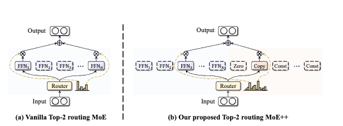

## [DeepSeek-MoE](https://arxiv.org/abs/2401.06066)
</img>

The two important contributions of DeepSeek-MoE are
 - Finely segmenting the exeprts
  - The idea is that if you have $N$ experts instead we will finely segment this experts more to have $mN$ experts, and the same for the routed experts where now we will have $mK$ routed experts
  - This idea helps with the problem of **Knowledge hybridity** (where an expert will have to mix a lot of differnt knowledge into its parameters instead of bieng more specialized), and consequently encourages sharper specialization
- Shared expert isolation
  - We isolate $K_s$ experts as shared ones (this experts are always active)
  - The idea here is that this models will capture general knowledge so as to reduce knowledge redundancy between the other experts (e.g. there is one expert that learns biology and another Laws, but in the end both have to learn about language, so instead we can have a shared expert that learns about language instead).
  - In the end the implementation looks like this:
  	- $h_t^l = \sum_{i=1}^{K_s} \mathrm{FFN}_i\!\left(u_t^l\right) + \sum_{i=K_s+1}^{mN} g_{i,t}\,\mathrm{FFN}_i\!\left(u_t^l\right) + u_t^l$
    - $$ g_{i,t} =
      \begin{cases}
      s_{i,t}, & s_{i,t} \in \mathrm{Topk}\!\left(\{\, s_{j,t} \mid K_s + 1 \le j \le mN \,\},\, mK - K_s\right) \\
      0, & \text{otherwise}
      \end{cases}
      $$
    - $s_{i,t} = \mathrm{Softmax}_i\!\left( (u_t^l)^\top e_i^l \right)$
    - Where:
      - $e^l_i$ ($i$ is the expert and $l$ is the layer) is the learned weight embeddings of the experts where $e \in R^{\text{hidden dim } \cdot \text{ number of experts}}$
      - $u$ is the result of the final projection of the Attention layer, where $u \in R^{\text{batch size} \cdot \text{seq len} \cdot \text{hidden dim}}$
      - $s$ are basically what we call the affinities that each token has to an expert, based on this we choose the experts that have the biggest affinity to a specific token and always our shared expert
      - $s$ are the end result affinities where the experts that where not chosen get a $g = 0$, so in the end they don't contribute anything to $h$, adn this is why MoE are sparse

## [MoE++](https://arxiv.org/abs/2410.07348)

</img>

The important contributions of this paper are the idea of Zero-Computation experts
- Discard: The zero expert, this basically discards the input, because it just outputs 0
- Skip: the copy expert, which replicates the input (so basically skips because it doesn't do any operation)
- Replace: it substitutes the input with a trainable vector (*I don't know about this idea*)
And the idea of this Zero-computation experts is to bring:
- Low computing overhead: Because here each token can essentially engage with a dynamic number of experts (just like with the idea of "Mixture-of-Experts with Expert Choice Routing", in this case by using a zero expert), be adjusted by constant vectors, or just even skip the MoE layers entirely
- High performance: it enables simple tokens deal with fewer FFN experts, so in this case more experts can focus on more challenging tokens, thereby unlocking greater performance potential than vanilla MoE (*but here MegaBlocks also allows this no?, because now experts don't have to drop tokens, there is no capacity factor here*)
- Deployment friendly: because here zero-computation experts have negligible parameters or zero, we can deploy this experts on each GPU, eliminating a lot of the communication overhead and expert load imbalance associated with FFN experts distributed across different GPUs
- Gating residuals: They also introduce this idea, where it lets tokens consider its pathways in previous layer when doing the routing for selecting the appropriate experts in the current MoE++ layer

And in the end this idea can let the model have an ever broader range of sub-network combinations


### Zero-computation experts
So what are this Zero computation experts:
- Zero experts: The simplest zero-computation that discards the input. Given input token $x$, the output is $E_{\text{zero}}(x)=0$. If a zero expert is selected in a Top-2 MoE++ layer, the layer’s output equals that of the other expert alone, effectively reducing Top-2 to Top-1 for that token.
	- **In a way, this method can be help Top-K experts router version be like Top-k tokens router (from expert choice routing), because we would be adding an operation that did nothing on the token, so basically we would have only m real experts working on the token**
	- Also this method can behave as a skip connection, because if only zero experts where used in a token, that means its output will be zero and then the token information will be added in the residual connection of the transformer architecture. *So we basically can hit two birds with one stone*

- Copy experts: Inspired by residual connections, the output equals the input, $E_{\text{copy}}(x)=x$. This lets a token bypass the MoE++ layer when it is poorly aligned with the available FFN experts. (**But the transformer architecture already has residual connections, So I don't understand still this idea, liek aren't we just adding the residuals two times in this case at the end?. Like the only difference is that the residual is added based on a sepcific weight**)

- Constant experts: Replace or blend the input with a trainable vector. The output is $E_{\text{const}}(x)=\alpha_{1}x+\alpha_{2}v$, with $[\alpha_{1},\alpha_{2}]=\mathrm{Softmax}(W_{c}x)$ and $W_{c}\in\mathbb{R}^{2\times D}$. This adds light learnable adaptation while keeping computation negligible. (*I think one can also define $\alpha_2$ to also just be $\alpha_2 = 1 - \alpha_1$*)
	- Compositional effects: Combining an FFN expert with a constant expert is equivalent to adjusting the FFN’s output using a trainable vector. Combining a zero expert with a copy expert allows the token to bypass the current layer entirely.
- But this experts still adds parameters no? And it doesn't even reduce the computation no? It just helps with communication overheard from parallel training I think

### Pathway aware router
Since MoE++ contains heterogeneous experts, the design of the router becomes even more critical compared to vanilla MoE. This router also considers the pathway taken in the previous layer when selecting the appropriate experts for the current layer. (*But like I feel this isn't necessary at force just because we added this heterogeneous experts, like this could have also been added without the new zero-experts*)

So here we add **Gating Residuals**, similar to the residuals in the Transformer network, we add the routing scores from the previous layer to the routing scores predicted by the current layer.

Given input token $\mathbf{x}^{\,j}$ at layer $j$ with $N$ experts:
$$
G(\mathbf{x}^{\,j}) =
\begin{cases}
\mathbf{W}^{\,j}\,\mathbf{x}^{\,j}, & j=1,\\[6pt]
\mathbf{W}^{\,j}\,\mathbf{x}^{\,j} + \mathbf{W}^{\,j}_{g}\,G(\mathbf{x}^{\,j-1}), & j>1,
\end{cases}
$$

with
$$
\mathbf{W}^{\,j}\in\mathbb{R}^{N\times D}, \qquad \mathbf{W}^{\,j}_{g}\in\mathbb{R}^{N\times N},
$$
where $D$ is the hidden size, $\mathbf{W^j}$ is the trainable weight matrix and $\mathbf{W_g}$ is another trainable transformation matrix to integrate the scores from the previous layers into the current one

### Load balance during pretraining
For the load balance loss, they use the normal *Switch Transformer* Load balance loss, but they also add:
**Heterogeneous Load balance loss**: In this architecutre, because the number of parameters in Zero-computation experts and FFN differ significantly, it makes it sub-optimal to allocate the same number of tokens to both type of experts (also because this experts are just to help maybe sometimes don't do any computation, so it doesn't have to be uniform based on this experts)

Given the $t_{th}$ input token $x_t$, the heterogeneous load balance loss $\mathcal{L_b}$ is:
$$
\mathcal{L}_{b}=\sum_{i=1}^{N}\eta_i\,f_i\,P_i
$$

with
$$
\eta_i=
\begin{cases}
1, & \text{if Expert } i \text{ is an FFN expert},\\
\tau, & \text{if Expert } i \text{ is a zero-computation expert},
\end{cases}
$$

and
$$
f_i=\frac{1}{T}\sum_{t=1}^{T}\mathbb{1}\!\big(\text{Token } \mathbf{x}_t \text{ selects Expert } i\big),\qquad
P_i=\frac{1}{T}\sum_{t=1}^{T}\mathrm{Softmax}\!\left(G(\mathbf{x}_t)\right)_i.
$$

Where $T$ is the number of tokens, $N$ is the number of experts, and $\mathbb{1}(\cdot)$ is the indicator function (1 if true, 0 if false). A small hyper-parameter $\tau$ means fewer tokens are allocated to the zero-computation experts, and a bigger one means fewer tokens are allocated to the zero-computation experts

*Note*: The thing is here that if $\tau$ is smaller than one, makes it so the penalty of going to zero-computation experts is smaller, so the router will be more willing to allocate more tokens to them no?. Here I feel that $\tau$ should be bigger than one, we want less tokens to use zero-experts (we want this to be a special thing no?, or is the idea to force the router to better understand when to use Real experts?


#### Expert Capacity:
They also add Expert capacity, so as to mitigate the severe load imbalance by limiting the maximum number of tokens routed to each expert. And here because MoE++ has different number of tokens for different number of experts, they also have to design varying capacities for each type of expert


For an MoE++ model with $N_{\text{FFN}}$ FFN experts and $N_{\text{ZC}}$ zero-computation experts, the total number of experts is $N = N_{\text{FFN}} + N_{\text{ZC}}$.

$$
C_i =
\begin{cases}
\gamma\,\dfrac{\tau\,T}{\tau N_{\text{FFN}} + N_{\text{ZC}}}, & \text{if Expert } i \text{ is an FFN expert},\\[8pt]
\gamma\,\dfrac{T}{\tau N_{\text{FFN}} + N_{\text{ZC}}}, & \text{if Expert } i \text{ is a zero-computation expert}.
\end{cases}
$$

Where $\gamma$ is the capacity factor and $T$ is the number of tokens.

Here similarly a small $\tau$ means more capacity is allocated to the zero computation experts

#### Final training objective
$\mathcal{L} = \mathcal{L_{ce}} + \beta \mathcal{L_b}$


### Interesting things:
- They find that constant experts improve the model more than the zero experts and copy experts. They say that probably it is because constant experts provide increased flexibility in handling the tokens. **But like this makes sense because it adds more parameters, If eel just having more finely-grained experts like DeepSeek-MoE brings the same results for this part**
- And the model using the three types of zero-computation experts is the one that has the best results
#### Effect of Gating residual
- They find that gating residuals help reduce the variance in routing scores (without affecting the mean and the range of values of the routing scores), and that they help ensure stable routing (*but the difference in scores was of 0.1 points, so i don't know if it helps in reallity*)
#### Effect of the number of constant experts
- Increasing the number of constant experts on average improves results but then decreases. They theorize that this is because it reduces the amount of the other type of experts (because they are replaced by the constant ones I think)
And they come with a formula to determine the correct amount of constant experts
$$n_{const} = \max(\frac{N_{FFN}}{4} - n_{zero} - n_{copy}, 1)$$
#### Expert load distribution at the task level
They find that the activation of FFN experts is not decided by simpler tasks. Because tasks like ARC challenge activate more FFN experts than ARC Easy task
- They say this shows that the amount of experts assigned is based more on the context of knowledge (information no?) and complexity at the token level, rather than the overall task difficulty
- They find that
	- zero experts are the ones with highest average number of activation compared to the other zero-computation experts
	- They also observe that the assignments can vary significantly across different task topics. *So this shows that MoE++ handles diverse topics by employing different expert assignment patterns*

#### Number of experts activated per token at the token level
- Verbs tend to activate a large number of FFN experts. Probably because verbs often convey rich semantic information (so more entropy?) and they frequently interact with nouns to form more complex semantic structures
- Nouns typically activate a moderate number of FFN experts
- And simple tokens with littel semantic (*like tokens that come from words that are divided by the tokenizer, e.g "pper" and "ather"*) tend to activate a small amount of FFN experts


**Note**: I don't know if in the end a normal MoE transformer that has a lot of finely grained experts can basically also learn this experts. **Like for 256 experts, maybe 20 of them will have some of this zero-computation expert behavior**


## [GPT-OSS](https://arxiv.org/pdf/2508.10925)

</img>

The GPT-OSS models are designed to be used within agentic workflows with strong instruction following, tool use and reasoning capabilities
- 120B model with 36 layers with 5.1B active parameters per token
- 20B model with 24 layers with 3.B active parameters
- And the reasoning capability can be adjusted by specifying in the prompt the amount of reasoning (e.g. low, medium or high)

#### MoE
- The 120B model has 128 experts with top-4 experts
- The 20B model has 32 with top-4 experts

The MoE models use the gated SwiGLU activation function (*but the input is not divided in half when being passed to the two linear layers*)

#### Attention
- For the attention blocks they alternate between banded window and fully dense patterns, where the bandwidth is 128 tokens.
- Each layer has 64 query heads of dimension 64 and uses the Grouped query attention with 8 key-value heads.
- And the important thing is that each attention head has a learned bias in the denominator fo the softmax (*so as to let softmax give 0 mass to all tokens to not pay attention to any tokens*), similar to off-by-one attention and attention sinks.

The attention formula is this:
$$P_i = \frac{e^{S_i}}{\sum_j e^{s_j} + \text{Bias}} = \frac{e^{S_i}}{\sum_j e^{s_j} + e^{b}}$$
where $\text{Bias} \in R^{\text{n\_heads} \times 1}$, and $b$ is the logit for the bias (this is the weight in the model). You can consider $b$ as another token basically that helps the model give 0 mass to the other tokens by giving the mass to this $b$ sink token

### Pretraining
For the pretraining they where focused on data of STEM, coding and general knowledge.

### Post-training
For the post training they do:
- Uses CoT RL similar to o3, and they teach the model how to reason, solve problems and how to use tools.
- The training dataset consists of problems from coding, math, science and more

### Harmony chat format (I don't know if this is also used in other OpenAI models)
And another important thing of this model is their idea for the chat format they use a chat format that gives special tokens to delineate message boundaries and uses keyword arguments (e.g., User and Assistant) to indicate message authors and recipients. In the end the roles structure lets the model have a role-based information hierarchy to resolve instruction conflicts: System > Developer > User > Assistant > Tool.

The format also introduces the idea of "channels" to indicate the visibility for each message, e.g. *analysis* is for CoT tokens, *commentary* is for function tool calling and *final* for answers shown to users. This format lets the model have advanced agentic features including interleaving tools calls within the CoT or providing preambles that outline longer action plans to the user.

```
<|start|>assistant
<|channel|>analysis
<|message|>I need Tokyo’s weather to answer—time to call the weather API.<|end|>

<|start|>assistant
<|channel|>commentary to=functions.get_weather
<|message|>{"location":"Tokyo"}
<|call|>

<|start|>functions.get_weather to=assistant
<|channel|>commentary
<|message|>{"temp":22,"condition":"sunny"}
<|end|>

<|start|>assistant
<|channel|>analysis
<|message|>OK, it’s 22 °C and sunny—now form the final reply.<|end|>

<|start|>assistant
<|channel|>final
<|message|>It’s 22 °C and sunny in Tokyo right now!<|return|>
```

Here in this example you can see why it is possible for the model to do tool calling while reasoning, thanks to the idea of channels it can correctly separate when it is reasnoning and when it is answering to the user in the end
